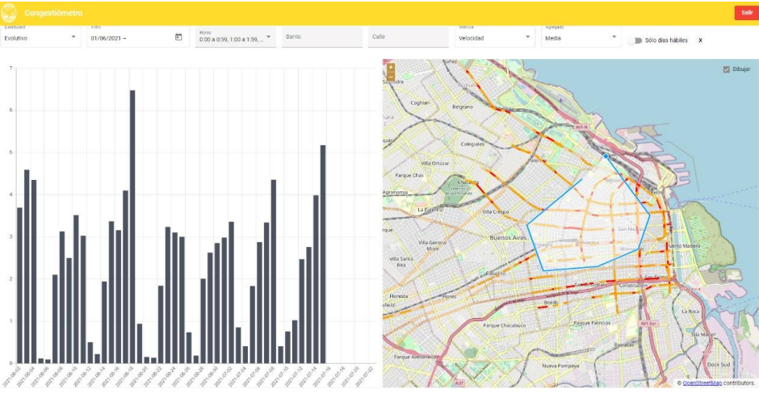
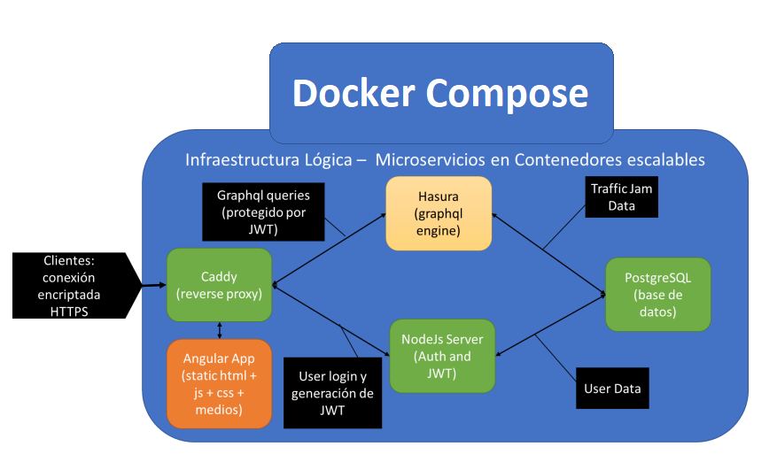

# Congestiómetro

  

---

  
  

---

## Contenidos

- [Introducción](#introducción)
- [Funcionalidades](#funcionalidades)
- [Alcance](#alcance)
- [Stack Tecnológico](#stack-tecnológico)

---

## Introducción

Esta herramienta tiene por objeto mejorar la gestión de la movilidad de las ciudades, tomando como punt ode partida la experiencia de Ciudad de Buenos Aires en base a datos masivos de Waze.

Con ella se pretende poder detectar anomalías e incidentes en el tránsito en tiempo real, identificar puntos críticos en la red para implementación de obras y políticas públicas relacionadas a la movilidad y evaluar su impacto. Predecir el comportamiento del tránsito de acuerdo con parámetros dinámicamente establecidos; todo ello con una herramienta de código abierto y sin licenciamientos pagos.

## Funcionalidades

1. Filtros por fechas y horas
2. Filtros complejos geográficos, pudiendo combinar la selección de barrios o comunas con un polígono arbitrario dibujado sobre el mapa
3. Filtro de calles y avenidas que funciona en combinación con el filtro geográfico
4. Métricas seleccionables: largo de cola, demora y velocidad
5. Funciones de agregación o reducción: media, máximo y último
6. Visualización individual o dual de mapa o gráfico de barras con las métricas seleccionas
7. Visualización comparativa de los últimos dos años por corredor seleccionado
8. Visualización de predicciones y su comparación contra el historico real.
9.

## Stack Tecnológico

### Arquitectura

 

### Entorno de ejecución

---

- [Docker](https://docs.docker.com/)
- [Docker Compose](https://docs.docker.com/compose/#compose-documentation)

 

### Microservicios

---

1. Web server y proxy inverso:
   - [Caddy](https://caddyserver.com/docs/)
1. Database:
   - [Postgres](https://caddyserver.com/docs/)
   - [Postgis](https://caddyserver.com/docs/)
1. Graphql:
   - [Hasura](https://hasura.io/docs/latest/index/)
1. Admin:
   - [NodeJS](https://nodejs.org/dist/latest-v16.x/docs/api/)
   - [Typescript](https://www.typescriptlang.org/docs/handbook/release-notes/typescript-4-0.html)
   - [Express](https://expressjs.com/es/api.html)
1. Interface Gráfica de Usuario:
   - [Angular](https://angular.io/docs)
   - [Angular Material](https://material.angular.io/)
   - [apollo-angular](https://apollo-angular.com/docs/)
   - [graphql-codegen](https://www.the-guild.dev/graphql/codegen)
   - [ng2-charts](https://github.com/valor-software/ng2-charts#readme)
   - [Open Layers](hhttps://developers.arcgis.com/openlayers/)
   - [turf](https://github.com/Turfjs/turf)
1. Modelo:
   - [Python 3](https://docs.python.org/3/)
   - [flask](https://flask.palletsprojects.com/en/2.1.x/)
   - [shapely](https://shapely.readthedocs.io/en/stable/manual.html)
   - [scikit-learn](https://scikit-learn.org/0.21/documentation.html)
   - [tensorflow](https://www.tensorflow.org/api_docs)
   - [psycopg2](https://www.psycopg.org/docs/)

## Documentación

- [Licencia](LICENSE)
- [Instrucciones de Instalación](docs/INSTALL.md)
- [Cómo Contribuir](docs/CONTRIBUTING.md)
- [Código de Conducta](docs/CODE_OF_CONDUCT.md)
- [Manual del Usuario](docs/manual_de_usuario.pdf)
- [Registro de Cambios](docs/CHANGELOG.md)
